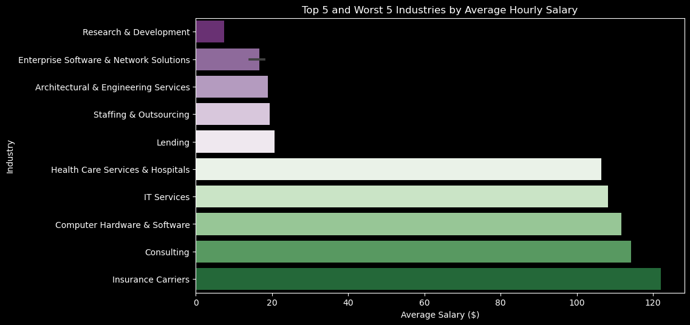

[](https://www.linkedin.com/in/felipe-roll/)

# Inspired by: [DS Salary Predictor](https://www.youtube.com/watch?v=MpF9HENQjDo&list=PL2zq7klxX5ASFejJj80ob9ZAnBHdz5O1t&index=2) 

# Data From: [Kaggle](https://www.kaggle.com/datasets/nikhilbhathi/data-scientist-salary-us-glassdoor) 

# Useful Links: 

* [Flask usage](https://medium.com/analytics-vidhya/ml-model-deployment-with-flask-on-local-host-part-i-300694542d68) 

* [Flask usage PT-BR](https://www.youtube.com/watch?v=_KNzvVsrB8k&list=PL2JCCEO_l_n1hdYHBJwte5bGRImRUiSm1&index=65)

* [Flask usage PT-BR](https://www.youtube.com/watch?v=FXYZkJkn_6c&list=PL2JCCEO_l_n1hdYHBJwte5bGRImRUiSm1&index=64)

# Project Overview: 
<b>This project aims to predict the salary of data science jobs, in order to assist them in negotiating their earnings</b>, the project used [this](https://www.kaggle.com/datasets/nikhilbhathi/data-scientist-salary-us-glassdoor) dataset. Other steps in this project are:
 * **Data Cleaning** - Preparing the dataset;
 * **Data analysis** - Searching for relevant columns to use in the model;
 * **Model Building** - Searching for the best model;
 * **Client facing API using Flask** - Visual way of predicting the salary.
&nbsp;
# Code and Resources used:
* **Python**
* **Packages**: pandas, numpy, sklearn, matplotlib, seaborn, flask, pickle, wordcloud, and a few models packages
* **For Web Framework Requirements**: ```pip install -r requirements.txt```
&nbsp;
# Data Cleaning steps:
* **Formatting Columns**

    * Format all columns name to have the same format;
    * Create dictionaries;
    * Change Age to company_age;
    * Change job location to show full state name;
    * Change Size column to create number of workers;
    * Change all columns to show Not available instead of -1;
    * Change Degree P = Postgraduate, M = Master(more extended qualification than postgraduate);
    * Change :\n to ' ' in job_desciption;
    * Change job_title_sim to uppercase in the first letter;
    * Reorder the columns. 

* **Creating Columns**

    * Create a new column to say if Job Location(Location column) and Company Headquarters(Headquarters) are in the same place; 
    * Create column to show avg salary per hour; 
    * Create column to show avg salary per month;
    * Create column to show avg salary per year;
    * Create column to show if higher degree is needed;
    * Create column Location City;
    * Create column Location State;
    * Create column Headquarters City;
    * Create column Headquarters State;
    * Create column for number of competitors.

* **Removing Columns**

    * Remove Location column; 
    * Remove Headquarters column;
    * Remove avg_salary(k) column;
    * Remove salary estimate; 
    * Remove index; 
    * Remove company name; 
    * Remove lower salary;
    * Remove upper salary. 
    
* **Dropping Rows**

    * Drop rows where 'job_title_sim' is 'na'; 
    * Drop rows where 'size' is 'unknown'; 
    * Drop rating column with negative values.
    &nbsp;
# Data Collection & Exploratory Data Analysis:
* Data was collected from [Kaggle](https://www.kaggle.com/datasets/nikhilbhathi/data-scientist-salary-us-glassdoor) 

* The Exploratory Data Analysis took form in the following steps:
   - Looking at the correlation between numeric columns

      

   - Plotting Histograms

   - Creating Word Clouds for Job Description, Job Titles, and Simplified Job Titles

     

   - Comparing many columns to the Average Salary

      

      

      

      

# Some insights from the Exploratory Data Analysis: 

* No high positive correlations, but some skills appear to be needed in conjunct very often;
* Words like "experience" and "team" are very often written in job descriptions;
* Company rating does not seem to affect the Salary offered;
* Insurance Carriers, Consulting, and Computer Hardware/Software industries are the one that pay the most;
* In the other hand, R&D, Enterprise Software and Engineering Services pay the least;
* Companies that have 2 competitors in the area normally pay the highest salaries;
* Company Revenue does not seem to affect Salary much;
* Dist. of Columbia, California, and Illinois are among the highest paying states, while New York, Colorado, and Florida among the least;
* If the Company is located in Dist. of Columbia, Massachusetts or California, the Average Salary is high, while Nebraska, Florida, and Alabama not so much;
* Company age does not seem to affect the salary, with the majority of the highest salaries being paid by companies with less than 100 years of existence;
* Some skills when needed in a job seem to actually make the salary on average go down.

# Model Building: 
The Model Building part of the project had the following steps:

* Converting Categorical Variables into dummy variables;
* Splitting the data into train and tests sets with a test size of 20%;
* Selecting the columns to be used in the models (only the skill columns were selected for a faster prediction);
* Testing various types of models;
    - Multiple Linear Regression
    - Lasso Regression
    - Random Forest
    - Gradiant Booster Tree
    - Support Vector Regression
    - Neural Network Regressor
* Testing combinations of those models;
* Selecting the best model 
The best model was <b>Random Forest</b> with a *Mean Absolute Error (Random Forest): 2038.3697536945808*. The second best was *(XGBoost + Random Forest): 2093.243452220597* and the third *(Lasso Regression + Random Forest): 2169.8340873515103*
&nbsp;
# Productionization
Here, a flask API endpoint was built and hosted on a local webserver. The API endpoint takes in a request with a list of values (skills required in this case) from a job listing and returns a predicted salary.
&nbsp;
# How to use
* Ensure that the required libraries are listed in a requirements.txt file. Install these libraries by running ```pip install -r requirements.txt```;
* Open a prompt in your computer as administrator and move to the folder you copied the project to (you may want to create a virtual enviroment for that);
* Run it with ```python app.py```;
* Copy to provided URL in the prompt and paste in your browser.
&nbsp;
# Developed by: 
  * [Felipe Roll - Linkedin](https://www.linkedin.com/in/felipe-roll)
  * [Felipe Roll - Github](https://github.com/FelipeLRoll)
  * [Felipe Roll - Gmail](felipelroll@gmail.com)
